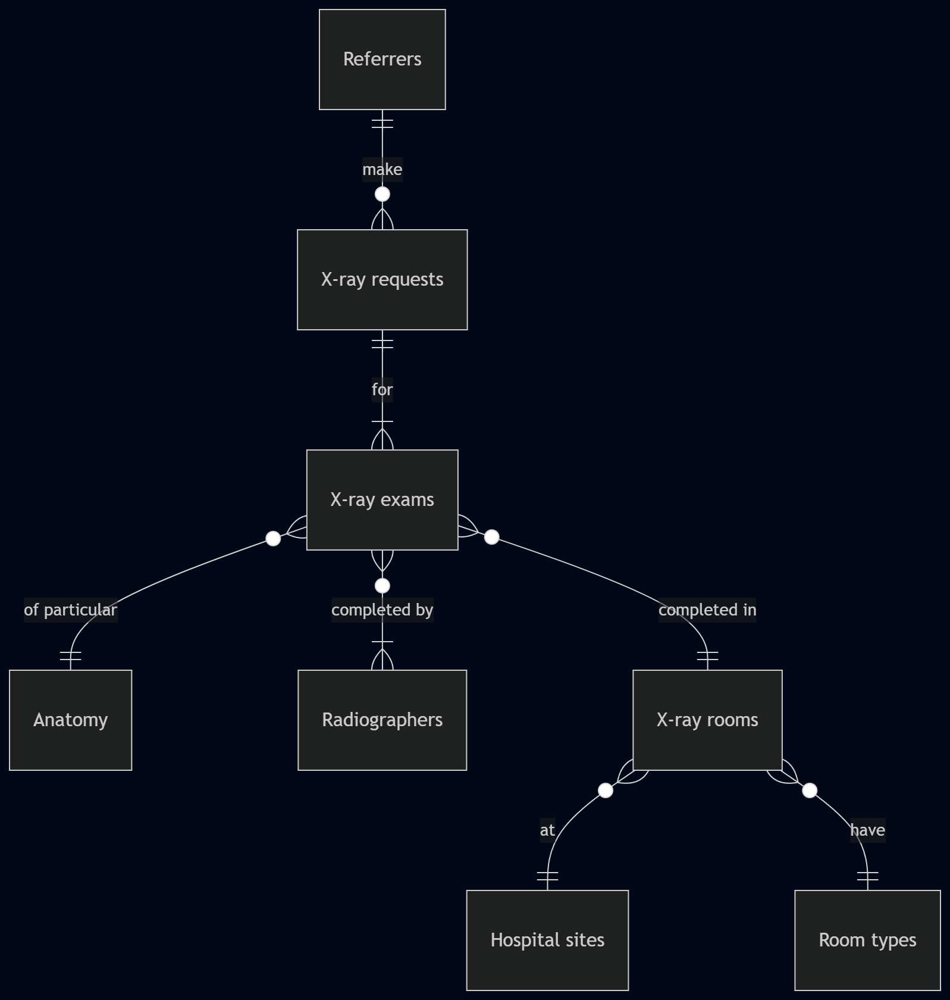

# Design Document
Completed as a final project for [CS50 SQL](https://cs50.harvard.edu/sql/).

## Scope

This is a database design for staff radiographers (radiology technicians) in hospital X-ray departments to see how their x-ray exams' radiation doses compare to those of other radiographers.

*Background*: Radiographers should aim to give doses that are "as low as reasonably practicable", and they record doses for every exam they carry out, usually in units such as cGycm^2. Doses vary widely depending on anatomy, pathologies, patients and equipment, as well as the radiographer's technique. This can make it difficult for a radiographer to judge how low or high their doses are, and doses can steadily drift higher without feedback.

*Purpose and scope*: The idea of this database is to provide dose information that may motivate radiographers to try and reduce their doses if theirs seem comparatively high. To enable like-with-like comparisons as far as possible, exam data includes the type of anatomy, which room (or other piece of equipment) was used, when the exam was completed, and who the referring clinician was. The database could also therefore be used to compare doses by equipment, area or referring speciality.

*Out of scope*: No information on patients, image rejection reasons or specific projection names are included. Referral information is limited to the referring clinician's identity and speciality.

## Functional Requirements

This database should support:
* CRUD operations for exams, radiographers, equipment, referrers, requests and hospital sites.
* Viewing radiographers ranked by their average exam doses for any particular anatomy, equipment and/or period of time.
* Further filtering by referrer, equipment type or hospital site.
* Imaging requests that may include multiple pieces of anatomy, and exams completed by one or more radiographers.

The database does not provide any patient information, other than exams being associated with a particular request.

## Representation

Entities are stored in SQLite tables, using the following schema.

### Entities

The database contains these entities.

#### Referrers

The `referrers` table includes:

* `id`, which specifies a unique ID for the referring clinician as an `INTEGER`. The `PRIMARY KEY` constraint is applied to this column.
* `referrer_code`, which specifies the referrer's unique identifying code. These are usually alphanumeric, so `TEXT` is used.
* `first_name`, which specifies the referrer's first name as `TEXT`.
* `last_name`, which specifies the referrer's last name as `TEXT`.
* `speciality`, which optionally specifies the referrer clinical specialism as `TEXT`.

All columns in the `referrers` table, except for `speciality`, are necessary and so have `PRIMARY KEY` or `NON NULL` constraints. The `referrer_code` also has the `UNIQUE` constraint.

#### Requests

The `requests` table includes:

* `id`, which specifies a unique ID for the request as an `INTEGER`. The `PRIMARY KEY` constraint is applied to this column.
* `referrer_id`, which is the ID of the referrer that submitted the request, as an `INTEGER`. This column has the `FOREIGN KEY` constraint applied, referencing the `id` column of the `referrers` table to ensure data integrity.

Both columns in the `requests` table are necessary and have either `PRIMARY KEY` or `FOREIGN KEY` constraints.

#### Exams

The `exams` table includes:

* `id`, which specifies a unique ID for the exam as an `INTEGER`. The `PRIMARY KEY` constraint is applied to this column.
* `request_id`, which is the ID of the request that includes this exam, as an `INTEGER`. This column has the `FOREIGN KEY` constraint applied, referencing the `id` column of the `requests` table to ensure data integrity.
* `anatomy_id`, which is the ID of the anatomy x-rayed in this exam, as an `INTEGER`. This column has the `FOREIGN KEY` constraint applied, referencing the `id` column of the `anatomy` table to ensure data integrity.
* `radiation_dose`, which specifies the recorded radiation dose given in this exam. The `NUMERIC` type is specified because values may be integers or decimal numbers.
* `start_time`, which specifies the date and time the exam was started, as `TEXT`.
* `end_time`, which specifies the date and time the exam was finished, as `TEXT`.
* `images_used`, which specifies the whole number of X-ray images uploaded to the hospital imaging archive, as `INTEGER`.
* `images_rejected`, which specifies the whole number of X-ray images taken but not uploaded to the hospital imaging archive, as `INTEGER`.
* `room_id`, which is the ID of the room or equipment used to complete this exam, as an `INTEGER`. This column has the `FOREIGN KEY` constraint applied, referencing the `id` column of the `rooms` table to ensure data integrity.

The following columns in the `exams` table are necessary and have `NOT NULL` constraints where there is no `PRIMARY KEY` or `FOREIGN KEY` constraint: `id`, `request_id`, `anatomy_id`, `radiation_dose`, `room_id`.

#### Anatomy

The `anatomy` table includes:

* `id`, which specifies a unique ID for the anatomy as an `INTEGER`. The `PRIMARY KEY` constraint is applied to this column.
* `anatomy_name`, which specifies a unique name for the anatomy as `TEXT`.

Both columns in the `anatomy` table are necessary and unique, and have either `NOT NULL` and `UNIQUE` constraints or a `PRIMARY KEY` constraint.

#### Radiographers

The `radiographers` table includes:

* `id`, which specifies a unique ID for the radiographer as an `INTEGER`. The `PRIMARY KEY` constraint is applied to this column.
* `operator_code`, which specifies the radiographer's unique identifying code (hence the `UNIQUE` constraint). These are usually alphanumeric, so `TEXT` is used.
* `first_name`, which specifies the referrer's first name as `TEXT`.
* `last_name`, which specifies the referrer's last name as `TEXT`.

All columns in the `radiographers` table, are necessary and so have `PRIMARY KEY` or `NON NULL` constraints. The `operator_code` also has the `UNIQUE` constraint.

#### Exams completed by radiographers

The `completed_by` table includes:

* `id`, which specifies a unique ID for the connection between an exam and a radiographer as an `INTEGER`. The `PRIMARY KEY` constraint is applied to this column.
* `exam_id`, which is the ID of the exam, as an `INTEGER`. This column has the `FOREIGN KEY` constraint applied, referencing the `id` column of the `exams` table to ensure data integrity.
* `radiographer_id`, which is the ID of the radiographer recorded as completing the exam, as an `INTEGER`. This column has the `FOREIGN KEY` constraint applied, referencing the `id` column of the `radiographers` table to ensure data integrity.

All columns in the `completed_by` table have either a `PRIMARY KEY` or a `FOREIGN KEY` constraint.

#### Rooms

The `rooms` table includes:

* `id`, which specifies a unique ID for an X-ray room or other piece of equipment as an `INTEGER`. The `PRIMARY KEY` constraint is applied to this column.
* `room_name`, which specifies the room's unique name or code (hence the `UNIQUE` constraint).
* `room_type_id`, which is the ID of the type of room or equipment, as an `INTEGER`. This column has the `FOREIGN KEY` constraint applied, referencing the `id` column of the `room_types` table to ensure data integrity.
* `site_id`, which is the ID of the site of this room or equipment, as an `INTEGER`. This column has the `FOREIGN KEY` constraint applied, referencing the `id` column of the `sites` table to ensure data integrity.

All columns in the `rooms` table are unique and have either a `PRIMARY KEY` or `FOREIGN KEY` constraint, or `NOT NULL` and `UNIQUE` constraints.

#### Hospital sites

The `sites` table includes:

* `id`, which specifies a unique ID for a site as an `INTEGER`. The `PRIMARY KEY` constraint is applied to this column.
* `site_name`, which specifies the site's unique name or code (hence the `UNIQUE` constraint).

Both columns in the `sites` table are necessary and unique, and have either `NOT NULL` and `UNIQUE` constraints or a `PRIMARY KEY` constraint.

#### Room types

The `room_types` table includes:

* `id`, which specifies a unique ID for a room or equipment type as an `INTEGER`. The `PRIMARY KEY` constraint is applied to this column.
* `room_type`, which specifies the type's unique name or code (hence the `UNIQUE` constraint).

Both columns in the `room_types` table are necessary and unique, and have either `NOT NULL` and `UNIQUE` constraints or a `PRIMARY KEY` constraint.

#### Views

Two views have been defined to make common queries more straightforward:

* `exam_details` joins together the main dose, referrer, equipment and location information and exam details for each exam.
* `exam_details_by_radiographer` joins together the information in `exam_details` and information about the radiographers completing each exam: This means exams will be duplicated if completed by multiple radiographers.

### Relationships

The following diagram describes the relationships between the entities in this database.

## Optimizations

The key database information, radiation dose, is in the `exams` table, so two indexes have been created to speed up likely queries that aim to compare like with like:
- `exams_by_anatomy`: It would rarely be useful to compare doses in e.g. finger x-rays (low dose) with e.g. lumbar spine x-rays (higher dose), so many queries are likely to specify a particular anatomy.
- `exams_by_room`: Dose levels can vary by equipment. This can be due to the machines themselves, but also the types of patients and imaging more likely to be done in them. For example, chest x-rays done in a "walking clinic" room will likely have lower doses than chest x-rays done on a mobile machine that is taken to image bedbound patients, where positioning is more difficult and so higher doses more likely.

## Limitations & possible improvements

- Exams are separated only by anatomy, not by projection/view. For example, a sideways lumbar spine image will likely be higher-dose than a frontal image, but both will be recorded under "lumbar spine".
- Anonymised views may be desirable so that a radiographer can only identify their own doses when comparing them with their colleagues'.
- Procedures and operators are limited to general X-ray and radiographers: It could make sense for a similar database to include doses in procedures performed partly or entirely by non-radiographers, such as radiologists or surgeons, to compare doses & screening times.
- It may be useful to separate year/date/time columns for exams, as having a single datetime makes it more difficult to look for exams taken in certain shift hours across multiple days.
- There is no reference to national or local dose reference levels, which may be important benchmarks worth having integrated in the database.
- Laterality issues: "Left wrist" and "Right wrist", for example, will currently be stored as different types of anatomy. Any queries about "wrist" doses will therefore need to manually include both sides.
- No patient details are recorded, which means examinations of small children cannot be differentiated from those of adults: This may skew the doses given, for example, in rooms that are used to image both children and adults.

- Other ideas for improvements:
    - Give radiographers weighted dose scores to make comparison easier
    - Write queries that help to investigate any common factors among the highest total doses
    - Write queries that make more use of the images used/rejected columns: Would it be useful to compare radiographers' image repeat rates? Do radiographers with higher doses per image have lower repeat rates?
